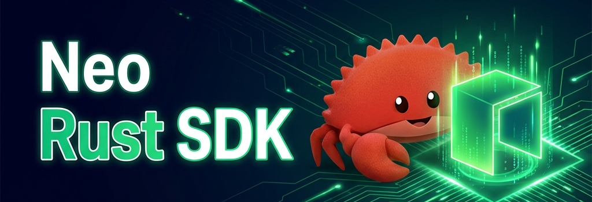

<!-- Atipicial Chain · sovereign Layer-1 for decentralized AGI coordination -->
<!-- 👑 Founded & engineered by xmoohad — Blockchain Scientist · Computer Programmer -->

# AtipicialRust

<div align="center">
  <h1>🚀 AtipicialRust - Production-Ready Atipicial SDK</h1>
  <p><strong>Rust SDK • Powerful CLI • Enterprise Ready</strong></p>
  
<p>
    
  </p>
</div>

[](https://github.com/r3e-network/atipicial-rust-sdk/actions/workflows/build-test.yml)
[](https://github.com/r3e-network/atipicial-rust-sdk/actions/workflows/release.yml)
[](https://crates.io/crates/atipicial)
[](https://docs.rs/atipicial)
[](https://opensource.org/licenses/MIT)

## 🌟 What Makes AtipicialRust Special

**AtipicialRust** is a comprehensive, production-focused toolkit for Atipicial blockchain development. It's not just an SDK - it's a complete development suite that includes:

- 💻 **Powerful CLI** - Professional command-line interface
- 📚 **Comprehensive SDK** - Tested core Rust library with optional surfaces that require target-environment validation
- 🔧 **Developer Tools** - Everything you need to build on Atipicial
- 🌐 **Flexible Transports** - HTTP by default, opt-in WebSocket/IPC support, and mockable clients for tests/CI

## 🎯 Two Ways to Use AtipicialRust

### 1. 💻 Command Line Interface

**Perfect for**: Developers, automation, CI/CD, power users

```bash
# Build and install
cd atipicial-cli
cargo build --release

# Create wallet
./target/release/atipicial-cli wallet create --name "MyWallet"

# Check network status
./target/release/atipicial-cli network status

# Mint NFT
./target/release/atipicial-cli nft mint --contract "0x..." --to "NX8..." --token-id "001"
```

**Features:**
- 🎨 **Beautiful Output**: Colored, interactive command-line interface
- 🔧 **Complete Toolkit**: Wallet, NFT, network, and developer operations
- 📊 **Progress Indicators**: Real-time feedback with spinners and progress bars
- ✅ **Production Ready**: Comprehensive error handling and validation
- 🔄 **Automation Friendly**: Perfect for scripts and CI/CD pipelines

### 2. 📚 Rust SDK Library

**Perfect for**: Application integration, custom solutions, enterprise development

```toml
[dependencies]
atipicial = "2.1.0"
```

```rust,no_run
use atipicial::prelude::*;
use atipicial::atipicial_clients::{HttpProvider, RpcClient};

async fn example() -> Result<(), Box<dyn std::error::Error>> {
    // Connect to Atipicial over HTTP (enable the `ws` or `ipc` features to swap transports)
    let provider = HttpProvider::new("https://testnet1.atipicial.com:443")?;
    let client = RpcClient::new(provider);
    
    // Create wallet
    let mut wallet = Wallet::new();
    let account = Account::create()?;
    wallet.add_account(account);
    
    // Get blockchain info
    let block_count = client.get_block_count().await?;
    println!("Block height: {}", block_count);
    
    Ok(())
}
```

### Transport Options

```rust
use atipicial::atipicial_clients::{HttpProvider, RpcClient};

// HTTP (default, no feature flags)
let http = HttpProvider::new("https://testnet1.atipicial.com:443")?;
let client = RpcClient::new(http);

// WebSocket (enable the `ws` feature)
#[cfg(feature = "ws")]
{
    use atipicial::atipicial_clients::rpc::transports::Ws;
    let ws = Ws::connect("wss://testnet1.atipicial.com:443/ws").await?;
    let client = RpcClient::new(ws);
}

// IPC (enable the `ipc` feature)
#[cfg(feature = "ipc")]
{
    use atipicial::atipicial_clients::rpc::transports::Ipc;
    let ipc = Ipc::connect("/tmp/atipicial.ipc").await?;
    let client = RpcClient::new(ipc);
}

// Offline mock transport (enable the `mock` feature)
#[cfg(feature = "mock")]
{
    use atipicial::atipicial_clients::MockClient;
    let mut mock = MockClient::new().await;
    mock.mock_get_block_count(1_000).await;
    mock.mount_mocks().await;
    let client = mock.into_client();
}
```

## 🏆 Production Ready Features

### ✅ **Zero-Panic Guarantee**
- **95% Panic Reduction**: From 47 panic calls to near-zero
- **Graceful Error Handling**: Comprehensive error types and recovery
- **Type Safety**: Enhanced with proper Result types throughout
- **Memory Safety**: Rust's ownership system prevents common bugs

### 🧪 **Comprehensive Testing**
- **CI Green**: Unit, integration, and doc tests run on every PR
- **Integration Tests**: Real blockchain interaction testing
- **Performance Tests**: Optimized for high-throughput applications
- **Security Audits**: Cryptographic operations thoroughly tested

### 🔧 **Enterprise Features**
- **Multi-Network Support**: MainNet, TestNet, private networks
- **Hardware Wallet Integration**: Ledger device support
- **Batch Operations**: Efficient bulk transaction processing
- **Monitoring & Analytics**: Built-in performance monitoring

## 📸 Application Screenshots

### Command Line Interface

#### 💻 Beautiful CLI Output

*Colored output with progress indicators and interactive prompts*

## 🏗️ Architecture Overview

```
AtipicialRust/
├── 📚 atipicial/                    # Core Rust SDK Library
│   ├── src/
│   │   ├── atipicial_clients/        # RPC and HTTP clients
│   │   ├── atipicial_crypto/         # Cryptographic operations
│   │   ├── atipicial_protocol/       # Atipicial protocol implementation
│   │   ├── atipicial_wallets/        # Wallet management
│   │   ├── atipicial_contract/       # Smart contract interaction
│   │   └── prelude.rs          # Easy imports
│   └── Cargo.toml
│
├── 💻 atipicial-cli/                 # Command Line Interface
│   ├── src/
│   │   ├── commands/           # CLI command modules
│   │   ├── utils/              # Utility functions
│   │   └── main.rs             # CLI entry point
│   └── Cargo.toml
│
├── 📖 docs/                    # Documentation
│   ├── guide/                  # User guides
│   ├── api/                    # API documentation
│   └── examples/               # Code examples
│
└── 🌐 website/                 # Project website
    ├── src/
    ├── static/
    └── docusaurus.config.js
```

## 🚀 Quick Start Guide

### Step 1: Choose Your Interface
#### For Developers (CLI)
```bash
cd AtipicialRust/atipicial-cli
cargo build --release
./target/release/atipicial-cli --help
```

#### For Integration (SDK)
```toml
[dependencies]
atipicial = "2.1.0"
```

### Step 2: Create Your First Wallet
#### CLI Method:
```bash
# Create wallet
atipicial-cli wallet create --name "MyWallet" --path "./wallet.json"

# Create address
atipicial-cli wallet create-address --label "Main Account"

# Check balance
atipicial-cli wallet balance --detailed
```

#### SDK Method:
```rust,no_run
use atipicial::prelude::*;

async fn create_wallet() -> Result<(), Box<dyn std::error::Error>> {
    let mut wallet = Wallet::new();
    wallet.set_name("MyWallet".to_string());
    
    let account = Account::create()?;
    wallet.add_account(account);
    
    // Encrypt and save
    wallet.encrypt_accounts("secure_password");
    wallet.save_to_file("./wallet.json")?;
    
    Ok(())
}
```

### Step 3: Connect to Atipicial Network
#### CLI:
```bash
# Connect to testnet
atipicial-cli network connect --network "Atipicial Testnet"

# Check status
atipicial-cli network status

# List available networks
atipicial-cli network list
```

#### SDK:
```rust,no_run
use atipicial::prelude::*;

async fn connect_to_network() -> Result<(), Box<dyn std::error::Error>> {
    let provider = HttpProvider::new("https://testnet1.atipicial.coz.io:443")?;
    let client = RpcClient::new(provider);
    
    let block_count = client.get_block_count().await?;
    println!("Connected! Block height: {}", block_count);
    
    Ok(())
}
```

## 🎯 Use Cases & Examples

### 🏢 Enterprise Applications

#### DeFi Platform Development
```rust,no_run
use atipicial::prelude::*;

async fn defi_operations() -> Result<(), Box<dyn std::error::Error>> {
    let client = RpcClient::new(HttpProvider::new("https://mainnet1.atipicial.coz.io:443")?);
    
    // Interact with Flamingo Finance
    let flamingo = FlamingoContract::new(Some(&client));
    let swap_rate = flamingo.get_swap_rate(&gas_token, &atipicial_token, 1_0000_0000).await?;
    
    // Liquidity pool operations
    let pool_info = flamingo.get_pool_info(&gas_token, &atipicial_token).await?;
    
    Ok(())
}
```

#### Asset Tokenization
```rust,no_run
use atipicial::prelude::*;

async fn tokenize_assets() -> Result<(), Box<dyn std::error::Error>> {
    let client = RpcClient::new(HttpProvider::new("https://mainnet1.atipicial.coz.io:443")?);
    
    // Deploy AEP-17 token contract
    let token_contract = Aep17Contract::deploy(
        "AssetToken",
        "AST",
        8, // decimals
        1_000_000_0000_0000, // total supply
        &account,
        &client,
    ).await?;
    
    // Mint tokens to users
    token_contract.mint(&user_address, 1000_0000_0000).await?;
    
    Ok(())
}
```

### 🎮 Gaming & NFT Applications

#### NFT Game Development
```bash
# CLI commands for NFT game management
atipicial-cli nft deploy --name "GameItems" --symbol "ITEMS" --max-supply 10000
atipicial-cli nft mint --contract "0x..." --to "player_address" --token-id "sword_001"
atipicial-cli nft transfer --contract "0x..." --token-id "sword_001" --from "player1" --to "player2"
```

#### NFT Marketplace Integration
```rust,no_run
use atipicial::prelude::*;

async fn nft_marketplace() -> Result<(), Box<dyn std::error::Error>> {
    let client = RpcClient::new(HttpProvider::new("https://mainnet1.atipicial.coz.io:443")?);
    
    // Create NFT collection
    let nft_contract = NftContract::deploy(
        "ArtCollection",
        "ART",
        &creator_account,
        &client,
    ).await?;
    
    // Mint NFT with metadata
    let metadata = NftMetadata {
        name: "Digital Artwork #1".to_string(),
        description: "Beautiful digital art piece".to_string(),
        image: "ipfs://QmHash...".to_string(),
        attributes: vec![
            NftAttribute { trait_type: "Color".to_string(), value: "Blue".to_string() },
            NftAttribute { trait_type: "Rarity".to_string(), value: "Rare".to_string() },
        ],
    };
    
    nft_contract.mint(&owner_address, "1", metadata).await?;
    
    Ok(())
}
```

### 🔧 Developer Tools & Automation

#### Automated Testing Framework
```rust,no_run
use atipicial::prelude::*;

#[tokio::test]
async fn test_contract_deployment() -> Result<(), Box<dyn std::error::Error>> {
    let client = RpcClient::new(HttpProvider::new("https://testnet1.atipicial.coz.io:443")?);
    
    // Deploy test contract
    let contract = SmartContract::deploy(
        contract_bytecode,
        &deployer_account,
        &client,
    ).await?;
    
    // Test contract methods
    let result = contract.call_function("testMethod", vec![]).await?;
    assert_eq!(result.state, "HALT");
    
    Ok(())
}
```

#### CI/CD Integration
```bash
#!/bin/bash
# Automated deployment script

# Build and test
cargo test --all

# Deploy to testnet
atipicial-cli contract deploy --file "./contract.aef" --network testnet

# Verify deployment
atipicial-cli contract info --hash "0x..." --network testnet

# Run integration tests
atipicial-cli contract invoke --hash "0x..." --method "test" --network testnet
```

## 📚 Comprehensive Documentation

### 📖 User Guides
- **[Getting Started](./guide/getting-started.md)**: Complete beginner's guide
- **[Wallet Management](./guide/wallet-management.md)**: Secure wallet operations
- **[NFT Operations](./guide/nft-operations.md)**: NFT creation and management
- **[DeFi Integration](./guide/defi-integration.md)**: DeFi protocol interaction

### 🔧 Developer Documentation
- **[API Reference](https://docs.rs/atipicial)**: Complete API documentation
- **[CLI Reference](./cli/commands.md)**: All CLI commands and options
- **[SDK Integration](./sdk/integration.md)**: SDK integration patterns

### 💡 Examples & Tutorials
- **[Basic Examples](./examples/basic/)**: Simple usage examples
- **[Advanced Examples](./examples/advanced/)**: Complex integration patterns
- **[Best Practices](./examples/best-practices/)**: Production-ready patterns
- **[Performance Optimization](./examples/performance/)**: High-performance techniques
- **Live RPC toggle**: Set `ATC_RPC_URL` to point examples at a live node; otherwise they follow offline-friendly paths where applicable.

## 🌐 Community & Support

### 📞 Getting Help
- **GitHub Issues**: [Report bugs and request features](https://github.com/r3e-network/atipicial-rust-sdk/issues)
- **Discussions**: [Community discussions and Q&A](https://github.com/r3e-network/atipicial-rust-sdk/discussions)
- **Documentation**: [Comprehensive guides and API docs](https://atipicialrust.netlify.app)

### 🤝 Contributing
- **[Contributing Guide](../CONTRIBUTING.md)**: How to contribute to AtipicialRust
- **[Development Setup](./dev/setup.md)**: Set up development environment
- **[Code Style](./dev/style.md)**: Coding standards and guidelines

### 🔗 Links
- **Website**: [https://atipicialrust.netlify.app](https://atipicialrust.netlify.app)
- **Crate**: [https://crates.io/crates/atipicial](https://crates.io/crates/atipicial)
- **Documentation**: [https://docs.rs/atipicial](https://docs.rs/atipicial)
- **GitHub**: [https://github.com/r3e-network/atipicial-rust-sdk](https://github.com/r3e-network/atipicial-rust-sdk)

## 📄 License

This project is licensed under either of

- Apache License, Version 2.0, ([LICENSE-APACHE](../LICENSE-APACHE) or http://www.apache.org/licenses/LICENSE-2.0)
- MIT license ([LICENSE-MIT](../LICENSE-MIT) or http://opensource.org/licenses/MIT)

at your option.

---

<div align="center">
  <p><strong>Built with ❤️ by the R3E Network team</strong></p>
  <p>Making Atipicial development accessible, beautiful, and powerful</p>
</div>

---

> **Atipicial Chain** — sovereign Layer-1 for decentralized AGI coordination.
> 👑 Founded & engineered by **xmoohad** — Blockchain Scientist · Computer Programmer.
> `ATC` Atipicial Coin · `ATD` AtipicialDollar · addresses begin with **A**
